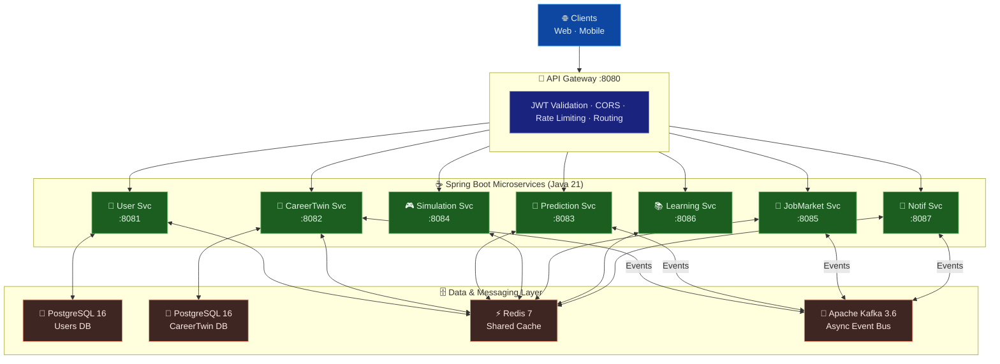

<div align="center">

# 🧬 SkillDNA AI

### World's First AI-Powered Career Digital Twin Platform

**Built by [Ravikumar](https://github.com/ravigithubcse) — Ravi Future Labs**

[](https://openjdk.org/)
[](https://spring.io/)
[](https://kafka.apache.org/)
[](https://postgresql.org/)
[](https://redis.io/)
[](https://docker.com/)

[](RELEASE_NOTES.md)
[](LICENSE)
[](docker-compose.yml)
[](https://github.com/ravigithubcse)

</div>

---

## 📌 What Is SkillDNA AI?

SkillDNA AI creates a **living AI digital twin of your career** — a dynamic model that continuously analyses your skills, work history, market trends, and industry shifts to give you personalised, data-driven career intelligence.

| Feature | Description |
|---------|-------------|
| 🧬 **Career Digital Twin** | A rich AI model of your skills, experience, and trajectory |
| 🔮 **Career Predictions** | AI-scored optimal paths and salary bands |
| 🎮 **What-If Simulations** | Explore "what if I learn X" before committing |
| 📊 **Job Market Intel** | Real-time demand signals for your skill set |
| 🎯 **Learning Paths** | Personalised skill-gap closure with ROI estimates |
| ⚠️ **Automation Risk** | Know your automation exposure before it's too late |

---

## 🏗️ Architecture



**Request Flow:**
1. Web/Mobile clients send all requests to the **API Gateway** (Spring Cloud Gateway :8080)
2. Gateway validates JWT tokens, enforces rate limits, and routes to the correct microservice
3. **User Service** handles registration, authentication, and profile management (PostgreSQL users DB)
4. **CareerTwin Service** builds the AI digital twin from skills, experience, and assessments (PostgreSQL twin DB)
5. **Prediction Service** runs ML models to forecast career trajectories and upskilling paths
6. **JobMarket Service** ingests real-time job postings and maps them to twin skill gaps via Kafka events
7. **Simulation Service** lets users run "what-if" career simulations without affecting their real twin
8. All 8 services share **Redis 7** for session caching, and async events flow over **Kafka 3.6**

---
---

## 🚀 Quick Start

### Prerequisites

| Tool | Version |
|------|---------|
| Docker | 24+ |
| Docker Compose | 2.24+ |
| Java (local dev) | 21 |
| Maven (local dev) | 3.9+ |

### 1. Clone

```bash
git clone https://github.com/ravigithubcse/skilldna-ai.git
cd skilldna-ai
```

### 2. Start the full stack

```bash
docker-compose up -d
```

This starts: PostgreSQL (users + careertwin), Redis, Kafka + Zookeeper + Kafka UI, and all 8 microservices.

### 3. Verify health

```bash
curl http://localhost:8080/actuator/health   # Gateway
curl http://localhost:8081/actuator/health   # User Service
curl http://localhost:8082/actuator/health   # Career Twin
```

### 4. Register a user

```bash
curl -X POST http://localhost:8080/api/v1/auth/register \
  -H "Content-Type: application/json" \
  -d '{
    "email": "roy@example.com",
    "password": "Secret@123",
    "firstName": "Roy",
    "lastName": "Ravi",
    "countryCode": "IND"
  }'
```

### 5. Login & get JWT

```bash
curl -X POST http://localhost:8080/api/v1/auth/login \
  -H "Content-Type: application/json" \
  -d '{"email":"roy@example.com","password":"Secret@123"}'
```

### 6. Create Career Digital Twin

```bash
TOKEN="<jwt-from-step-5>"

curl -X POST http://localhost:8080/api/v1/career-twin \
  -H "Authorization: Bearer $TOKEN" \
  -H "Content-Type: application/json" \
  -d '{
    "headline": "Java Full Stack Developer | IoT & AI",
    "currentRole": "Associate Software Engineer",
    "currentCompany": "Trinity Mobility",
    "yearsExperience": 2,
    "countryCode": "IND",
    "city": "Bengaluru",
    "skills": [
      {"skillName":"Java","level":"ADVANCED","category":"PROGRAMMING_LANGUAGE","yearsUsed":2,"isPrimary":true},
      {"skillName":"Spring Boot","level":"ADVANCED","category":"FRAMEWORK","yearsUsed":2,"isPrimary":true},
      {"skillName":"Apache Kafka","level":"INTERMEDIATE","category":"DATA_ENGINEERING","yearsUsed":1},
      {"skillName":"Angular","level":"INTERMEDIATE","category":"FRAMEWORK","yearsUsed":1},
      {"skillName":"PostgreSQL","level":"INTERMEDIATE","category":"DATABASE","yearsUsed":2}
    ],
    "workExperiences": [
      {
        "companyName": "Trinity Mobility",
        "roleTitle": "Associate Software Engineer",
        "startDate": "2024-07-01",
        "isCurrent": true,
        "description": "Built real-time IoT data pipelines using Apache Kafka and Spring Boot 3.x"
      }
    ]
  }'
```

---

## 📖 API Documentation (Swagger UI)

| Service | URL | Port |
|---------|-----|------|
| User Service | http://localhost:8081/swagger-ui.html | 8081 |
| Career Twin Service | http://localhost:8082/swagger-ui.html | 8082 |
| Prediction Service | http://localhost:8083/swagger-ui.html | 8083 |
| Simulation Service | http://localhost:8084/swagger-ui.html | 8084 |
| Job Market Service | http://localhost:8085/swagger-ui.html | 8085 |
| Learning Service | http://localhost:8086/swagger-ui.html | 8086 |
| Notification Service | http://localhost:8087/swagger-ui.html | 8087 |
| Kafka UI | http://localhost:9093 | 9093 |

---

## 📦 Microservices

| Service | Port | Technology | Description |
|---------|------|-----------|-------------|
| `api-gateway` | 8080 | Spring Cloud Gateway | JWT validation, CORS, routing |
| `user-service` | 8081 | Spring Boot 3 + JPA | Auth, registration, profiles |
| `career-twin-service` | 8082 | Spring Boot 3 + JPA | Career Digital Twin engine |
| `prediction-service` | 8083 | Spring Boot 3 | AI career & salary prediction |
| `simulation-service` | 8084 | Spring Boot 3 | What-if career scenarios |
| `job-market-service` | 8085 | Spring Boot 3 | Real-time job market intel |
| `learning-service` | 8086 | Spring Boot 3 | Skill gap & learning paths |
| `notification-service` | 8087 | Spring Boot 3 + Kafka | Multi-channel notifications |

---

## 🗂️ Project Structure

```
skilldna-ai/
├── backend/
│   ├── api-gateway/              # Spring Cloud Gateway :8080
│   ├── user-service/             # Auth + profiles :8081
│   │   └── src/main/java/com/ravifl/skilldna/user/
│   │       ├── controller/       # AuthController, UserController
│   │       ├── service/          # UserService (JWT + BCrypt)
│   │       ├── entity/           # User, SubscriptionTier
│   │       ├── repository/       # UserRepository (JPA)
│   │       ├── dto/              # RegisterRequest, LoginRequest, AuthResponse…
│   │       ├── security/         # JwtService, JwtAuthenticationFilter
│   │       ├── config/           # SecurityConfig, OpenApiConfig
│   │       ├── exception/        # GlobalExceptionHandler
│   │       └── mapper/           # UserMapper (MapStruct)
│   ├── career-twin-service/      # Career Digital Twin :8082
│   ├── prediction-service/       # AI predictions :8083
│   ├── simulation-service/       # What-if engine :8084
│   ├── job-market-service/       # Job market intel :8085
│   ├── learning-service/         # Learning paths :8086
│   └── notification-service/     # Notifications :8087
├── ai-services/                  # Python FastAPI AI layer (v1.1)
├── frontend/                     # Angular 17 SPA (v1.2)
├── infrastructure/               # Docker, Kubernetes, Terraform
├── .github/workflows/ci.yml      # GitHub Actions CI/CD
├── docker-compose.yml            # Full local dev stack
├── pom.xml                       # Maven multi-module parent
├── RELEASE_NOTES.md
├── SECURITY.md
└── README.md
```

---

## 🔑 Environment Variables

| Variable | Default | Description |
|----------|---------|-------------|
| `JWT_SECRET` | `SkillDNA-AI-Super-...` | JWT signing secret (min 32 chars) |
| `JWT_EXPIRATION_MS` | `3600000` | Token TTL (ms) — 1 hour |
| `DB_HOST` | `localhost` | PostgreSQL host |
| `DB_NAME` | service-specific | Database name |
| `DB_USER` | `skilldna` | Database user |
| `DB_PASSWORD` | `skilldna_pass` | Database password |
| `REDIS_HOST` | `localhost` | Redis host |
| `KAFKA_SERVERS` | `localhost:9092` | Kafka bootstrap servers |

> ⚠️ **Never commit real secrets.** Use environment-specific `.env` files or a secrets manager in production.

---

## 🧪 Running Tests

```bash
# All services unit tests
mvn test --no-transfer-progress

# Single service
cd backend/user-service && mvn test

# With JaCoCo coverage report (80% minimum gate)
cd backend/user-service && mvn verify
open target/site/jacoco/index.html
```

---

## 📋 API Reference

### Authentication (User Service)

| Method | Endpoint | Auth | Description |
|--------|----------|------|-------------|
| `POST` | `/api/v1/auth/register` | Public | Register new user, returns JWT |
| `POST` | `/api/v1/auth/login` | Public | Login, returns JWT |
| `GET` | `/api/v1/users/me` | JWT | Get my profile |
| `PATCH` | `/api/v1/users/me` | JWT | Update profile |
| `PATCH` | `/api/v1/users/{id}/tier` | JWT | Update subscription tier |

### Career Digital Twin

| Method | Endpoint | Auth | Description |
|--------|----------|------|-------------|
| `POST` | `/api/v1/career-twin` | JWT | Create Career Digital Twin |
| `GET` | `/api/v1/career-twin` | JWT | Get my Career Twin (full detail) |
| `PUT` | `/api/v1/career-twin` | JWT | Update + recalculate AI scores |
| `DELETE` | `/api/v1/career-twin` | JWT | Delete Career Twin |

### Predictions

| Method | Endpoint | Auth | Description |
|--------|----------|------|-------------|
| `POST` | `/api/v1/predictions/career-path` | JWT | AI career path options |
| `POST` | `/api/v1/predictions/salary` | JWT | AI salary band prediction |
| `GET` | `/api/v1/predictions/user/{id}/latest` | JWT | Latest prediction result |

---

## 🏛️ Design Principles

- **Clean Code** — SonarQube-ready, cyclomatic complexity <15 per method
- **SOLID** — Interface-driven design, dependency injection throughout
- **Fail Fast** — Validation at API boundary, unified error codes
- **Observability** — Spring Actuator, structured logging, Kafka audit events
- **Security by Default** — JWT on all protected routes, BCrypt (cost 12), non-root containers
- **Zero Boilerplate** — MapStruct for mapping, Lombok for models, Flyway for migrations

---

## 🔮 Roadmap

| Version | Target | Features |
|---------|--------|---------|
| **v1.0.0** | ✅ June 2026 | 8 microservices, JWT auth, Career Twin, Predictions, Docker Compose, CI/CD |
| **v1.1.0** | Q3 2026 | Python FastAPI NLP/LLM layer, Redis caching activated, Kafka consumers |
| **v1.2.0** | Q4 2026 | Angular 17 frontend, resume parser, LinkedIn import |
| **v1.3.0** | Q1 2027 | Kubernetes Helm charts, Enterprise SSO, multi-tenant isolation |
| **v2.0.0** | Q2 2027 | Real-time job matching, LLM interview coach, peer benchmarking |

---

## 👥 Contributors

| Role | Name | GitHub |
|------|------|--------|
| Founder & Lead Engineer | Ravikumar | [@ravigithubcse](https://github.com/ravigithubcse) |
| Platform | Ravi Future Labs | [skilldna-ai](https://github.com/ravigithubcse/skilldna-ai) |

---

## 📄 License

MIT License — Copyright © 2026 Ravikumar, Ravi Future Labs

See [LICENSE](LICENSE) for full text.

---

<div align="center">

**Built with ❤️ by [Ravikumar](https://github.com/ravigithubcse) — Ravi Future Labs**

*Empowering every professional with an AI career co-pilot*

⭐ **Star this repo** if SkillDNA AI inspires you!

</div>
